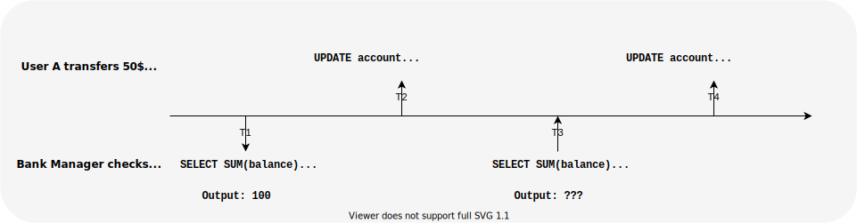
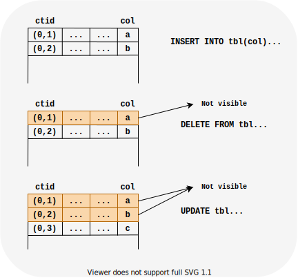

# Intro - What is this doc?
Its hard trying to manage a postgresql database by yourself especially when you have little experience with databases.
We will discuss
- a little bit of postgresql internals like storage structure on disk
- routine operations?
- moving around postgres using psql
- our monitoring & reporting setup
- and finally finding out & resolving common issues using

# Setting up postgres
You can easily setup postgresql on your local using docker. This setup is fine if you just want to play around with postgres.
After setting up docker, run this command in your terminal.
```bash
docker run --name postgres-playground -d postgres
```
You can run this comand connect to postgres once the container is ready.
```bash
docker exec -it postgres-playground psql -U postgres postgres
```
Stop and remove the container once you are done
```bash
docker stop postgres-playground
docker rm postgres-playground
```

# A little brief of MVCC and basic architecture/internals of postgres.
## What is MVCC?
PostgreSQL provides concurrent access to the database using MVCC. Without this, if someone is writing to database and someone else accesses this data during the same time, they would see missing or inconsistence piece of data. MVCC helps you provide *Isolation* which gurantees concurrent access to data.



Let's assume that a bank has only two users and total balance in bank is 100$. Now, user *A* transfers 50$ to user *B*. At T1, the bank manager would see 100$ as bank balance. At T3, the output would still be 100$ in this case because postgres provides isolation and both the transactions have different view of that table.

## How postgresql implements MVCC?
Every table in postgres, has some additional [system columns](https://www.postgresql.org/docs/current/ddl-system-columns.html). *ctid* is one such column which stores the physical location of that row. You can use a query like this to get ctid of a row.
```sql
SELECT ctid, * FROM <table name> LIMIT 10;
```


Deleting a row marks updates that row that its not visible for future transactions. Updating a row creates a new copy of the row and update the previous row so that its not visible for future transactions.

## VACUUM
Because of how MVCC is implemented, tuples that are updated & deleted in a table are not physically deleted from their table. This results in increase in size of tables if vacuum is not run frequently on that table. To handle this increasing storage, you can run `VACUUM` manually or make sure `autovacuum` is running. `VACUUM` goes through each table and marks the older versions of tuples for deletion. `VACUUM` doesn't free up disk space, but can be reused for future inserts on this table. To free up disk space and completely remove bloat from that table, you can run `VACUUM FULL` but it takes an exclusive lock on the table.

> Its not recommended to run `VACUUM FULL` on a production database.

### MVCC Exercise
1. Create an empty table
```sql
CREATE TABLE tbl (id bigserial primary key, col text);
```
2. Insert two rows and check their physical location
```sql
INSERT INTO tbl(col1) VALUES ('a'), ('b');
SELECT ctid, * FROM tbl;
```
3. Delete the row where col value is `a` and check their physical location
```sql
DELETE FROM tbl WHERE col = 'a';
SELECT ctid, * FROM tbl;
```
4. Update the row where col value is `b` and check their physical location
```sql
UPDATE tbl SET col = 'c' WHERE col = 'b';
SELECT ctid, * FROM tbl;
```
You will notice that physical location of that row has now changed.

5. Run VACUUM FULL and check physical location of rows
```sql
VACUUM FULL tbl;
SELECT ctid, * FROM tbl;
```
You will notice that physical location has changed again after running vacuum.

## Additional Resources
* MVCC Unmasked by Bruce Momjian - [Slides](https://momjian.us/main/writings/pgsql/mvcc.pdf) | [Video](https://www.youtube.com/watch?v=gAE_MSQtqnQ)
* Postgres, MVCC, and you or, Why COUNT(*) is slow by David Wolever - [Slides](https://speakerdeck.com/wolever/pycon-canada-2017-postgres-mvcc-and-you) | [Video](https://www.youtube.com/watch?v=GtQueJe6xRQ)

# psql

psql is the official CLI shipped with postgresql. Its really important to know how to move around a database and psql is a perfect tool for that. Check this [cheat sheet](./psql-cheat-sheet.md) to get familiar with psql.

# Monitoring, Observability & Reporting

## Opensource monitoring tools
You can setup one of these tools to get better visiblity into your database:
* [pgwatch](https://pgwatch.com/)
* [pgMonitor](https://github.com/CrunchyData/pgmonitor)
* [Percona Monitoring and Management](https://www.percona.com/doc/percona-monitoring-and-management/)

You can also setup [pgbadger](https://github.com/darold/pgbadger), a tool which parses logs and generates a report on database usage and workload. You can use this to find out slow queries that need fixing or tune postgresql parameters for your workload. Since pgbgadger works on logs, you won't get a realtime view of your database instance.

## System metrics
There are a lot of metrics you might want to track, but these are one of the most important ones
- CPU
- Memory
- Connections
- Burst Balance & IOPS

## Performance Insights in [AWS RDS](https://docs.aws.amazon.com/AmazonRDS/latest/UserGuide/USER_PerfInsights.html)

This is a feature of RDS which shows you running queries in real time.

# Index Types
Most of the times, the performance problems in a database are due to a missing index. There are different types of indexes avaialble and some might give good performance gains depending on the use-case. By default, postgres uses a btree index.

While creating an index, I try to follow these rules:
 * Don't create an index if you know its not going be used. Unnecessary indexes will slow down your writes.
 * `Multi-column indexes`: If your queries have multiple conditions, a [multi-column index](https://www.postgresql.org/docs/current/indexes-multicolumn.html) might be useful. The order of columns is really important here. Let's assume you have a table with the below structure with a btree index on (col1, col2).
 ```sql
                           Table "public.tbl1"
 Column |  Type   | Collation | Nullable |             Default
--------+---------+-----------+----------+----------------------------------
 id     | integer |           | not null | nextval('tbl1_id_seq'::regclass)
 col1   | integer |           |          |
 col2   | integer |           |          |
Indexes:
    "tbl1_col1_col2_idx" btree (col1, col2)
```
If you make a query like:
   * `SELECT * FROM tbl1 WHERE col1 = 10 AND col2 = 20` - Index scan
   * `SELECT * FROM tbl1 WHERE col1 = 10` - Index scan
   * `SELECT * FROM tbl1 WHERE col2 = 20` - Sequential scan. Depends on the data distribution and the `WHERE` clause.
 * `Partial indexes`: If you know that a part of the `WHERE` clause would have a fixed condition. e.g. `WHERE active = TRUE AND col1 = ?` where `active = TRUE` is the only condition on `active` column in your queries, you can create a [partial index](https://www.postgresql.org/docs/current/indexes-partial.html). Partial indexes are smaller in size and are more performant as well.
 * Indexes on expressions: You can create an index on an expression as well (e.g. `lower(textcol1)`). If queries on a table has some expressions, it it's a good idea to create an index on that expression.

## Additional Resources
* [Index Types](https://www.postgresql.org/docs/current/indexes-types.html)
* [Get rid of your unused indexes!](https://www.cybertec-postgresql.com/en/get-rid-of-your-unused-indexes/)

# Identifying ongoing issues
Run [queries/connections_per_user.sql](queries/connections_per_user.sql) and check if `max_running_time` is high for `state` - `active` and `idle in transaction`. There is a problem if number of connections or `max_running_time` for queries in `active` or `idle in transaction` state is high. `high` is subjective here and depends on the database size and type of workload. In my experience, number of `active` connections should be less than number of database's cpu cores and `max_running_time` should be less than 1 second.
 * If time for `idle in transaction` queries is high, then
    * either your application is taking time to commit transactions because its under heavy load or is doing some time consuming task before committing. Or application is not handling transactions properly.
    * some dev started a transaction and didn't commit it and left the connection open
 * If time for `active` queries is high, then
    * Queries are in waiting state. Queries can be in waiting state for multiple reasons. In [queries/active_running_queries.sql](queries/active_running_queries.sql) output, check `wait_event_type` and `wait_event` to figure out why the query is in waiting state. Reference: https://www.postgresql.org/docs/current/monitoring-stats.html#WAIT-EVENT-TABLE (Its better to check documentaton for postgres version you are workng with). Most of the time, its because:
      * two or more connections are working (lock) on the same row.
      * Someone executed some migrations and because of an `idle in transaction` or `active` query, this DDL query took a lock on that table preventing queries on table.
    * Query is expensive and is taking time. In this case `wait_event_type` and `wait_event` is null or its taking time to read data from disk (`wait_event_type` is `IO`). If the number of queries is also high, your database is probably under high CPU Utilisation. Fix for this is:
      * check if an index is missing. You can use `EXPLAIN` and `EXPLAIN ANALYZE` (NEVER USE `EXPLAIN ANALYZE` for a query which will modify data. This actually executes the query.)
      * providing more memory so that indexes can fit into memory or data can be cached into memory. For this, check disk reads. If its high, tune params (work_mem, shared_buffers, effective_cache_size) or increase memory for the instance.
      * increase CPU because the number of queries executed per second is high.

Having queries in `idle in transaction` state can cause a lot of issues in the long run. Because a query is in `idle in transaction` state and that connection holds a lock on a table, `VACUUM` won't run on that table because of which the size of that table might keep on increasing.

# Performance Tuning
* **Connection pooling** - every postgresql connection is a forked process on postgres. Lots of connections & disconnections can result in increased CPU utilization of your database. Setting up a connection pooler can create a lot of impact in performance. Most web frameworks provides connection pooling out of the box, but you can also setup external connection poolers like [pgbouncer](https://www.pgbouncer.org/) or [pgpool-II](https://www.pgpool.net).

* **Indexes** - one of most common problems which can result in low performance is missing indexes. Using pgbadger you can identify slow queries and identify tables which are missing indexes. Postgresql provides a variety of indexes (btree, brin, gin, etc.).

* **Parameter tuning** - I have seen people vertically scale postgres without attempting to understand bottlenecks causing performance problems. It is really important to tune your parameters for your workloads to gain desired performance. You can generate a default configuration using [PGTune](https://pgtune.leopard.in.ua/). But don't forget to understand more about your workloads and tune accordingly.

# Things to add:
 * json vs jsonb
 * int vs bigint
 * char vs varchar vs text
 * Add installation instructions for psql
